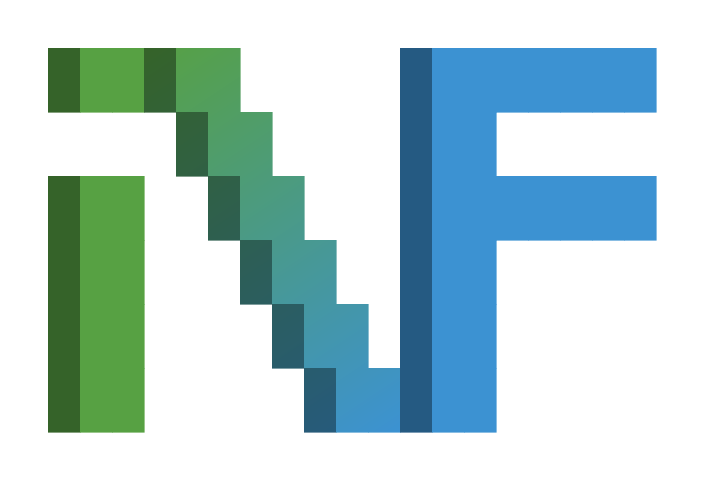

  <picture>
    <source media="(prefers-color-scheme: dark)" srcset="./assets/logo-dark.svg">
    
  </picture>

  Organization-level defaults and shared assets for
  <a href="https://github.com/if-then-nvim">if-then-nvim</a>.

## What lives here

| Path | Rendered at |
|---|---|
| `profile/README.md` | [the organization profile](https://github.com/if-then-nvim) |
| `assets/` | referenced by that profile and by each product's README |

Nothing here ships to a user. The plugins live in their own repositories.

## Assets

| File | Used for |
|---|---|
| `logo.svg` `logo-dark.svg` | the `if` mark, light and dark |
| `logo.png` `logo-dark.png` | raster fallback |
| `avatar.svg` `avatar.png` | the organization avatar |
| `social-preview.png` `social-preview-1280.png` | Open Graph preview |
| `hero.webp` | if.nvim's screenshot, hosted here rather than in that repository |

Each product keeps its own logo under `assets/logo-light.svg` and
`assets/logo-dark.svg`, drawn on the same grid as the mark above: 32×64
cells, 29×61 blocks, every stroke a shadow cell and a body cell, with the
gradient spanning only the `if.` prefix.
